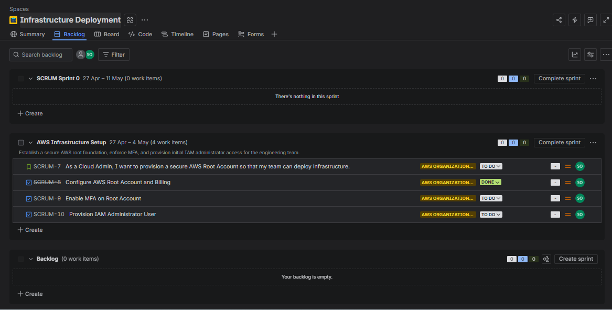

# Agile Command Center & ChatOps Automation (Jira + Slack)

## Project Overview

This project demonstrates the setup of an Agile project management environment using Jira Cloud, tailored specifically for Cloud Infrastructure deployments. It includes a custom ChatOps automation pipeline that integrates Jira directly with Slack via Webhooks to provide real-time, event-driven deployment updates to the engineering team.

## Technology Stack

- **Project Management:** Jira Cloud (Scrum, Kanban, Epics, Stories)
- **Automation:** Jira Automation Rules, Webhooks, JSON payloads
- **Communication:** Slack (Incoming Webhooks Integration)

---

## Phase 1: Agile Environment Provisioning & Sprint Planning

To simulate a real-world cloud deployment, the Jira environment was configured from scratch, bypassing default templates to create a customized workspace for AWS infrastructure provisioning.

Work was structured using the Agile hierarchy:

1. **Epic:** `AWS Organization Foundation` (The master initiative)
2. **User Story:** Defining the high-level business requirement for a secure AWS Root account.
3. **Tasks:** Granular engineering steps (e.g., *Configure AWS Root Account and Billing*, *Enable MFA on Root Account*, *Provision IAM Administrator User*).

***A clean, custom-built Jira backlog showing the engineered AWS deployment tasks properly linked to the master Epic, ready to be loaded into a Sprint.***

Once the backlog was groomed, the tickets were loaded into an active Sprint with a defined goal, and the Kanban board was launched to track the deployment lifecycle.

***The active Sprint board visualizing the workflow, allowing engineers to pull infrastructure tasks from "To Do" into "In Progress" and "Done".***

---

## Phase 2: ChatOps Pipeline Engineering

To eliminate the manual overhead of updating team members on deployment statuses, an event-driven automation pipeline was engineered to push notifications directly into the team's Slack workspace.

### 1. Slack Webhook Configuration

An Incoming Webhook integration was established in the Slack workspace and routed directly to the `#system-admin-team` channel, generating a secure endpoint to receive external HTTP POST requests.

### 2. Jira Automation Rule

A custom automation rule was built in Jira to listen for specific board events and trigger a data payload to the Slack endpoint.

- **Trigger:** Issue transitioned (To Status: `DONE`).
- **Action:** Send web request (HTTP POST to the Slack Webhook URL).
- **Payload:** A custom JSON body utilizing Jira smart values to dynamically pull ticket data.

JSON

`{
  "text": "✅ *Deployment Task Completed:*\n*Ticket:* {{issue.key}} - {{issue.summary}}\n*Engineer:* {{initiator.displayName}}\n*Status:* Ready for review."
}`

*Caption: Configuring the Jira Automation rule, defining the "Issue Transitioned" trigger and injecting the custom JSON payload into the Web Request action.*

### 3. Pipeline Execution & Verification

Upon completing an infrastructure task on the Kanban board, the automation rule successfully triggers, pushing the formatted alert to the engineering team in real-time.

***Successful ChatOps execution, the automated JSON payload is received and beautifully formatted within the Slack #system-admin-team channel.***

