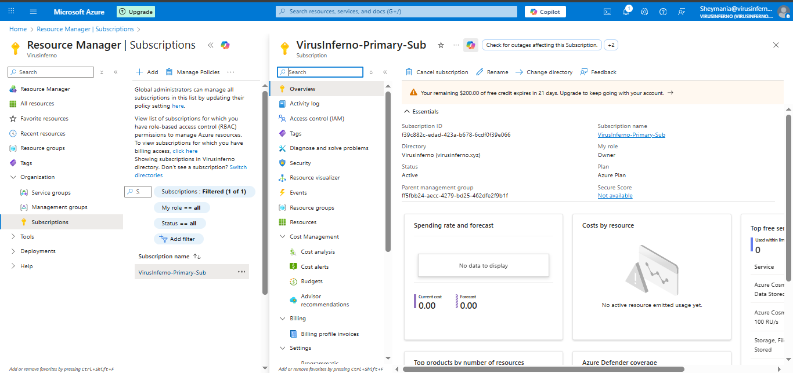
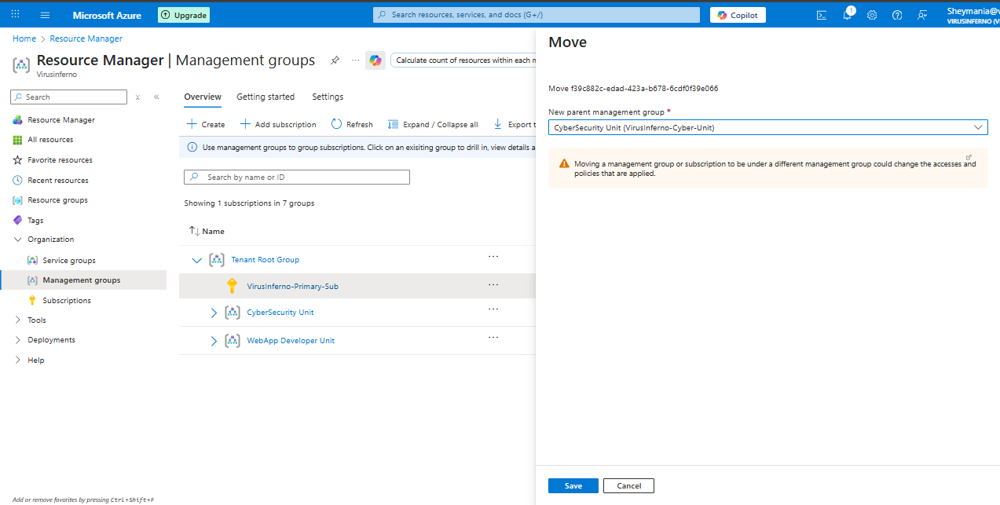
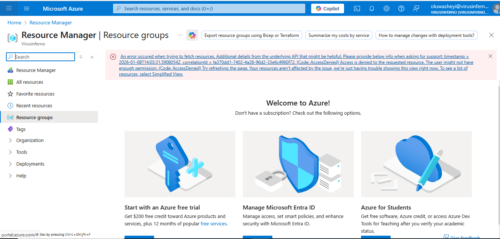
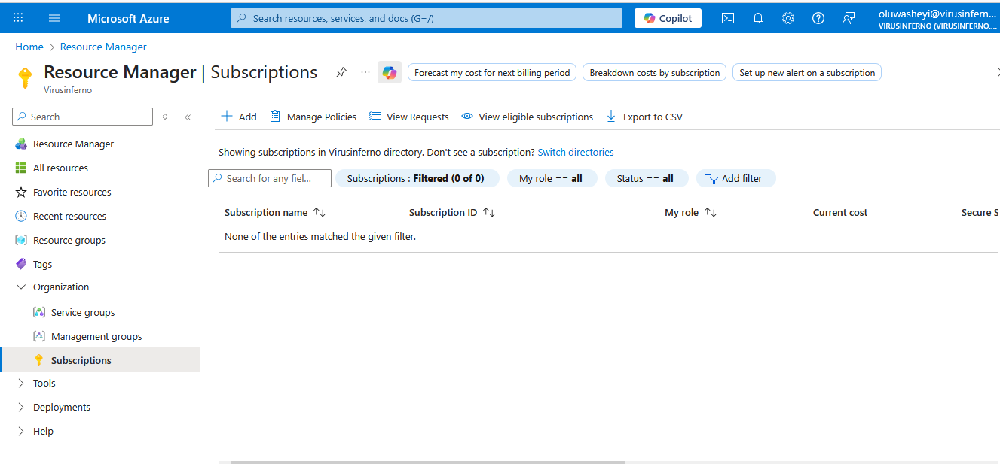
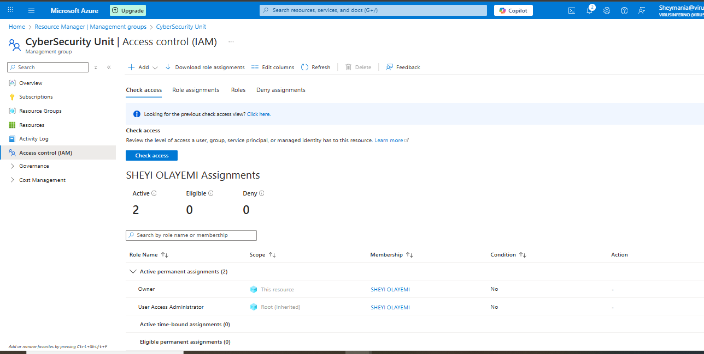
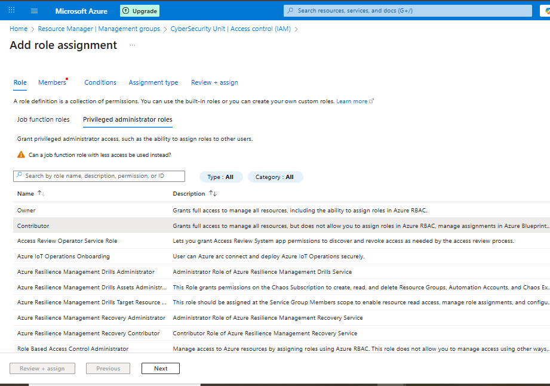
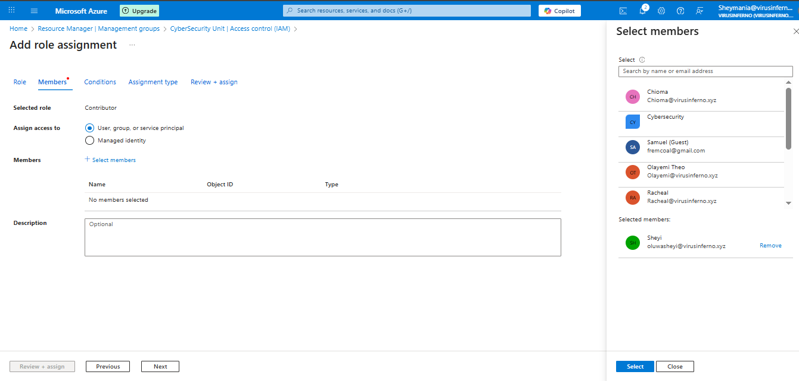
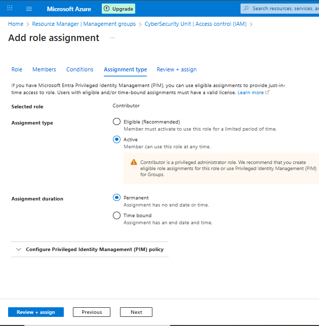

# Azure Cloud Organizational Hierarcy & Governance

### **Introduction** & Objective

In the final phase of my roadmap, I focused on **Governance** and **Structure**. I learned that placing all resources in a single "flat" list is unmanageable for a serious enterprise. To run **VirusInferno Tech** professionally, I needed to implement the Azure Hierarchy Pyramid.

My objective was to build a logical structure (Management Groups) that mimics my company's real-world departments, ensuring that permissions and policies applied at the top automatically flow down to all subscriptions and resources below.

## The Hierarchy Strategy

I designed my environment based on the four levels of Azure scope:

1. **Tenant (Root):** VirusInferno Tech (The Organization).
2. **Management Groups:** Logical containers for departments (e.g., CyberSecurity Unit).
3. **Subscriptions:** The billing entity.
4. **Resource Groups:** Containers for specific projects.

## Implementation Steps

### Step 1: Creating Management Groups & Sub-Units

I started by creating the departmental structure to organize my teams logically.

- **Path:** Search for **"Management Groups"** in the Azure Portal.
- **Action:** I created two parent Management Groups:
    1. `CyberSecurity Unit`
    2. `WebApp Developer Unit`

**Nesting Sub-Units:**
To demonstrate granular governance, I created specific sub-units inside these parents:

- **Inside CyberSecurity Unit:**
    - Created `Blue Team (SOC)` for defensive operations.
    - Created `Red Team (Pen-Testing)` for offensive security testing.
- **Inside WebApp Developer Unit:**
    - Created `Frontend UI Team` for interface designers.
    - Created `Backend API Team` for server-side engineers.

> 
> 
> 
> 
> 

### Step 2: Creating a Resource Group with Tags

Next, I created a container for my actual resources. I wanted to ensure this group was properly labeled for billing and management purposes.

- **Path:** Search for **"Resource groups"**.
- **Action:** I clicked **Create**.
    - **Subscription:** Selected my Free Trial subscription.
    - **Resource Group Name:** `VirusInferno-Lab-RG`.
    - **Region:** I selected **UK South** (or your preferred region).

**Tagging Strategy (Best Practice):**
Instead of just clicking "Review + create," I navigated to the **Tags** tab. Tags are critical for governance, allowing me to filter resources by environment or owner. I added the following metadata:

- **Environment:** `Lab`
- **Owner:** `Oluwasheyi`
- **Department:** `CyberSecurity`
- **Finalize:** I clicked **Review + create** -> **Create**.
- **Purpose:** This group now serves as a "Kill Switch." If I need to clean up my lab to stop costs, I can simply delete this one Resource Group, and every resource inside it (tagged 'Lab') will be destroyed instantly.

> Created a Resource Group named `VirusInferno-Lab-RG`
> 
> 
> 
> 

### Step 3: Organizing the Subscription (Renaming & Scoping)

Before moving the billing unit, I noticed it had a generic default name ("Azure subscription 1"). To maintain professional governance standards, I decided to rename it first and then file it into the correct department.

**Part A: Renaming the Subscription**

- **Path:** I searched for **"Subscriptions"** in the top search bar.
- **Action:** I clicked on my active subscription.
- **Modification:** I selected **"Rename"** from the top menu.
- **New Name:** `VirusInferno-Primary-Sub`
- **Why?** In a large enterprise with multiple subscriptions, generic names are confusing. Giving it a descriptive name ensures I know exactly what this billing unit is for.

> 
> 
> 
> 
> 

**Part B: Moving the Subscription (Scope Assignment)**
Once renamed, I moved the subscription into the hierarchy to activate governance inheritance.

- **Path:** I navigated back to **"Management Groups"**.
- **Current State:** I saw `VirusInferno-Primary-Sub` sitting loosely under the "Tenant Root Group."
- **Action:** I clicked the **"..." (Options)** button next to the subscription and selected **"Move"**.
- **Destination:** I selected the **`CyberSecurity Unit`** from the dropdown list.
- **Save:** I clicked **Save** to confirm the move.

> 
> 
> 
> 
> 

**Result:**
My subscription is no longer floating at the root level. It is now nested inside the **CyberSecurity Unit**. This means any Azure Policy I apply to the "CyberSecurity" folder (e.g., "Restrict Server Locations to UK South") will automatically apply to this subscription and all resources inside it.

### Step 4: Proof of Concept – RBAC & Role Inheritance

Finally, I performed a practical test to demonstrate **Azure Role-Based Access Control (RBAC)** and the principle of **Inheritance**. This test proves that managing access at the top level is far more efficient than managing it resource-by-resource.

**Part A: The Default "Zero Trust" State (The Blind Test)**

- **Action:** I logged in as my standard user `sheyi` (before assigning any new roles).
- **Observation:** The Azure Portal was empty. I saw the message *"No subscriptions found."*
- **Why?** This confirms that Azure operates on a **"Deny by Default"** security model. Unless a user is explicitly given permission, they cannot see or touch anything.

*No subscriptions found.*

**Part B: Applying Permission at Scope**
I switched back to my **Admin** account to grant access, but instead of adding the user to the Subscription or the Resource Group, I went higher up the ladder.

- **Path:** I navigated to the **`CyberSecurity Unit`** Management Group.
- **Action:** I clicked **Access control (IAM)** > **+ Add** > **Add role assignment**.
- **Role Selection:** I chose **"Contributor"**.
    - *Note:* I chose *Contributor* because it allows the user to create and manage resources (VMs, Networks) but prevents them from granting access to others (which only *Owners* can do).
- **Member:** I searched for and selected **`sheyi`**.
- **Review:** I clicked **Review + assign**.

I chose *Contributor*

 **I searched for and selected `sheyi`**

**I clicked Review + assign.**

**Part C: Verification (The Waterfall Effect)**
I logged back in as `sheyi` to verify the impact.

- **Result:** Without me touching the Subscription or the Resource Group settings directly, `sheyi` could now see:
    1. The **Management Group** (`CyberSecurity Unit`).
    2. The **Subscription** (`VirusInferno-Primary-Sub`).
    3. The **Resource Group** (`VirusInferno-Lab-RG`).
    4. All future resources created inside these containers.

**The Resource Group (`VirusInferno-Lab-RG`).**

**Conclusion:**
This proved that **Permissions Inherit Downwards**. By granting the "Contributor" role once at the Management Group level, it automatically cascaded down to the Subscription and Resource Groups below it. This "Write Once, Apply Everywhere" approach is how I plan to manage the **VirusInferno Tech** environment efficiently.

## Final Project Summary

I have successfully transitioned **VirusInferno Tech** from a basic setup to a governed enterprise environment. I have established a hierarchy that supports scalability, billing isolation, and efficient access management. My cloud foundation is now complete and ready for resource deployment.

# Final Roadmap Conclusion: The VirusInferno Tech Cloud Foundation

## Executive Summary

Over the course of these eight foundational projects, I have successfully architected a fully functional, enterprise-grade Microsoft Azure environment from scratch. Starting with zero infrastructure, I have built a secure, governed, and branded cloud tenant capable of supporting real-world business operations.

## Key Technical Milestones Achieved

1. **Identity Sovereignty:**
I moved away from generic defaults by procuring **`virusinferno.xyz`** and establishing it as the authoritative identity for my tenant. This ensures that all user identities (e.g., `oluwasheyi@virusinferno.xyz`) are professional and consistent.
2. **Security Defense-in-Depth:**
I implemented a "Zero Trust" security posture. By configuring **Smart Lockouts**, banning weak passwords, and enforcing **Per-User MFA**, I have hardened the environment against common identity attacks like Brute Force and Phishing.
3. **Scalable Administration:**
Recognizing that manual work is inefficient, I mastered **Bulk Operations** and **Group-Based Access Control**. I created functional teams (`CyberSecurity`, `WebApp Developer`) to manage permissions dynamically, rather than assigning rights user-by-user.
4. **Enterprise Governance:**
In the final phase, I deployed the **Azure Management Group Hierarchy**. By nesting my subscriptions and resources under departmental units (`CyberSecurity Unit`, `Blue Team`), I proved that I can manage governance at scale using **Role-Based Access Control (RBAC)** inheritance.

## Readiness Statement

**VirusInferno Tech** has transitioned from a simple "Free Tier" account into a structured, governed, and secure enterprise environment. The foundation is now complete. I am fully prepared to begin the next phase of the DevOps roadmap: deploying compute resources, configuring virtual networks, and implementing CI/CD pipelines within this secured framework.