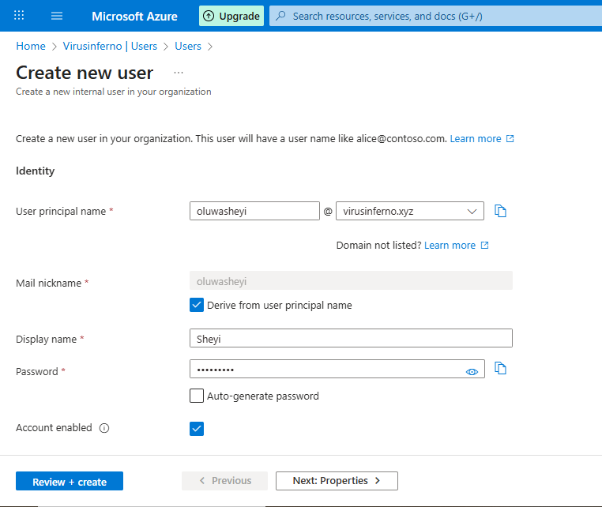

# Azure Entra ID IAM - Single User Management

### **Introduction** & Objective

With the environment branded and secured, I moved to the core of cloud administration: **Identity and Access Management (IAM)**. The goal of this project was to learn how to onboard humans into the cloud tenant so they can access resources.

I focused on distinguishing between the two primary identity types in Microsoft Entra ID:

1. **Members:** Internal employees (e.g., `Oluwasheyi@virusinferno.xyz`).
2. **Guests:** External partners or contractors (e.g., users with `@gmail.com`).

## Implementation Steps

### Step 1: Creating an Internal Member

My first task was to create a standard corporate identity for a staff member.

- **Path:** **Entra ID** > **Users** > **All users** > **New user** > **Create new user**.
- **User Principal Name (UPN):** I entered **`Oluwasheyi`**. I ensured the domain dropdown was set to my custom domain **`@virusinferno.xyz`**.
- **Display Name:** `Sheyi`.
- **Password:** I selected "Auto-generate password" and copied the temporary credential to a secure note.
- **Properties:** To ensure good governance, I filled in the Job Information:
    - **Job Title:** Authenticator Manager.
    - **Department:** CyberSecurity.

> 
> 
> 
> 
> 

### Step 2: Inviting an External Guest (B2B)

Next, I simulated a scenario where I needed to collaborate with an external consultant who does not belong to my organization.

- **Path:** **Users** > **New user** > **Invite external user**.
- **Email:** I entered the external email address (e.g., a secondary Gmail account).
- **Message:** I added a custom invitation message: *"Welcome to the VirusInferno Tech cloud environment."*
- **Action:** I clicked **Invite**.

### Step 3: The Guest Acceptance Flow

I verified the process from the guest's perspective.

1. The guest received an email invitation.
2. They clicked **"Accept Invitation"**.
3. Microsoft performed a verification check (sending a code to their Gmail) to prove they owned the account.
4. Once verified, they gained access to my tenant as a "Guest" user, not a Member.

> 
> 
> 
> 
> 

## Summary

I successfully onboarded my first internal user, **Oluwasheyi**, effectively giving them a digital identity within **VirusInferno Tech**. I also demonstrated the B2B capability by inviting an external user. This confirms my ability to manage the lifecycle of both internal staff and external partners.

**NEXT PAGE HERE👇👇👇**

[Bulk User Management & Group Administration](Bulk%20User%20Management%20&%20Group%20Administration%202e0d65318cf6803eab67f37d591a0e86.md)