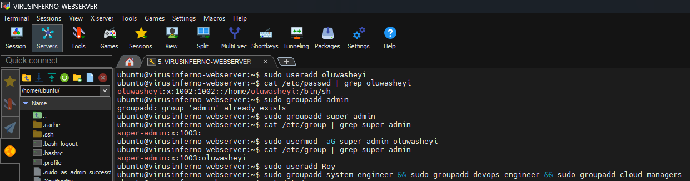
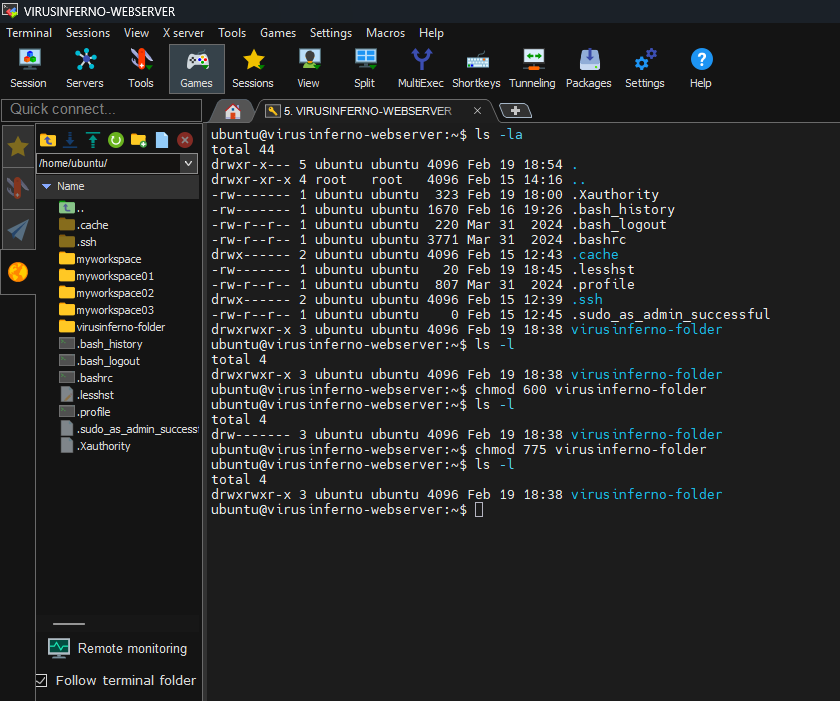
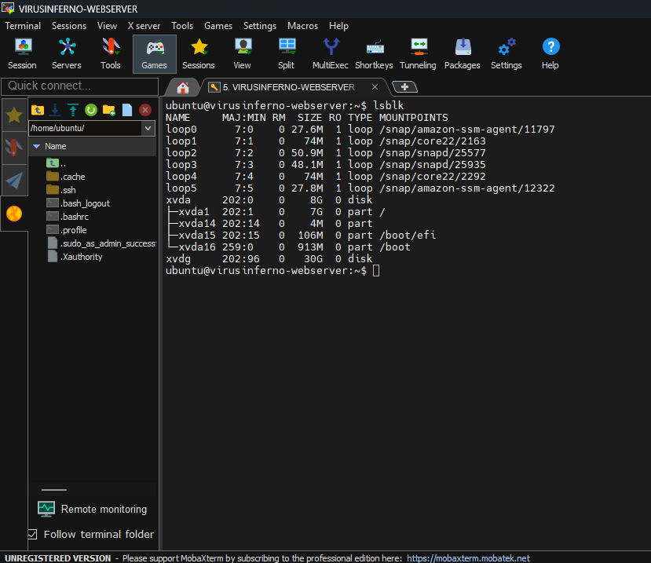
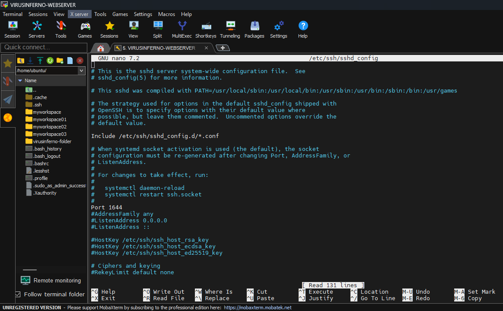
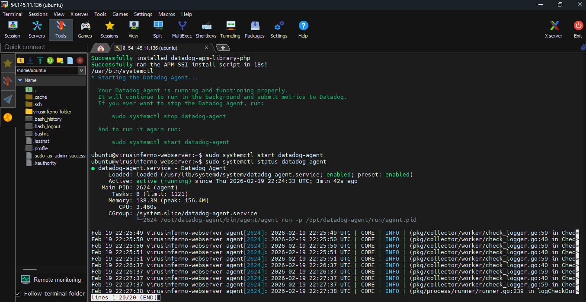
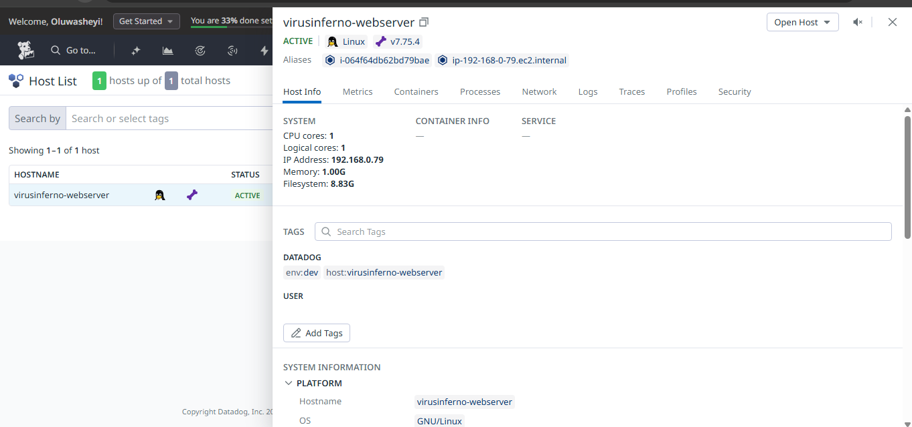

# 🛡️ Linux System Administration & Cloud Security Operations

---

**Project Author:** Oluwasheyi Ojelade

**Status:** Completed

**Tech Stack:** AWS, Linux (Ubuntu/Debian), Datadog

**Date:** February 17, 2026

---

---

## Part 1: Linux History & Fundamentals

### **1.1 The Evolution of Operating Systems**

Understanding the lineage of Linux explains its architecture and philosophy.

1. **UNIX (The Grandfather):**
    - Created in the 1970s at **AT&T Bell Labs** by **Ken Thompson** and **Dennis Ritchie**.
    - It was powerful and stable but proprietary (expensive).
2. **MS-DOS (The Closed Garden):**
    - **Bill Gates** & **Paul Allen** bought QDOS, renamed it **MS-DOS**, and licensed it to IBM.
    - **Philosophy:** **Closed Source**. You buy the binary, but you cannot see, modify, or fix the code.
3. **GNU/Linux (The Open Revolution):**
    - **Richard Stallman:** Started the **GNU Project** (GNU's Not Unix) to create free tools.
    - **Linus Torvalds:** A student who wrote the **Kernel** (the core) and released it for free.
    - **Philosophy:** **Open Source**. The source code is public. Anyone can see it, change it, sell it, or give it away.

### **1.2 The "Flavors" of Linux (Distributions)**

Because the Kernel is free, different groups packaged it with their own tools, creating "Distros".

| **Family** | **Key Distros** | **Package Manager** | **Usage** |
| --- | --- | --- | --- |
| **Debian Family** | Ubuntu, Kali Linux, Linux Mint | `apt` / `.deb` | Most popular, beginner-friendly. Used in this course. |
| **Red Hat Family** | RHEL, CentOS, Fedora, AlmaLinux | `yum` / `dnf` / `.rpm` | Enterprise standard. Used by Banks and Governments. |
| **SUSE Family** | OpenSUSE, SLES | `zypper` / `.rpm` | Popular in European infrastructure. |

> **Diagram of Linux Distributions**
> 
> 
> 
> 

### **1.3 Linux Architecture Layers**

1. **Hardware:** The physical machine (CPU, RAM, Hard Disk).
2. **Kernel:** The "Brain." It is the only thing that talks directly to the Hardware.
3. **Shell:** The "Translator." It takes human commands and translates them into 0s and 1s for the Kernel.
4. **Applications:** The software users interact with (Web Servers, Database).

### **1.4 Types of Shells**

- **`sh` (Bourne Shell):** The original. Basic, no colors, no auto-complete.
- **`bash` (Bourne Again Shell):** The modern standard. Supports colors, history, and scripting. **Default for Linux.**
- **`zsh` (Z Shell):** Highly customizable (now the default on macOS).
- **`csh` (C Shell):** Uses C-like syntax.

---

## Part 2: User & Group Administration

### **2.1 Connecting to Servers (Multi-Exec)**

We used **MobaXterm** to manage multiple servers simultaneously.

- **Multi-Exec Mode:** Allows typing a command in one window and executing it on all connected servers instantly.

### **2.2 Creating Users: `useradd` vs `adduser`**

This is a critical distinction for a SysAdmin.

- **Command 1: `sudo useradd oluwasheyi`**
    - The "Low Level" native command.
    - ❌ **Problem:** Creates a user **without** a Home Directory, **without** a password, and assigns the basic `sh` shell.
    - *Result:* The user looks "broken" (Login prompt is just `$`).
- **Command 2: `sudo adduser oluwasheyiojelade`**
    - The "High Level" interactive script.
    - ✅ **Benefit:** Asks for a password, creates `/home/oluwasheyi`, and assigns the `bash` shell automatically.

### **2.3 Fixing User Issues**

If a user was created poorly, we fix them using `usermod`.

1. **Fixing the Shell (The "Ugly Terminal" Fix):**Bash
    
    `sudo usermod -s /bin/bash username`
    
2. **Adding to Groups (Sudo Access):**Bash
    - **Rule:** You cannot put a Group inside a Group. You put **Users** into Groups.
    - To give a user Admin (Root) rights:
    
    `sudo usermod -aG sudo username`
    
    *(Note: `-a` = Append, `-G` = Group)*
    

### **.4 Automation with Chaining**

Use `&&` to run multiple commands. If the first fails, the second won't run.

Bash

`sudo groupadd DevOps && sudo groupadd CloudAdmin && sudo groupadd LinuxUsers`

> 
> 
> 
> 
> 

---

## Part 3: File System, Permissions & Security

### **3.1 Troubleshooting SSH Connections**

- **Scenario:** Private key (`key.pem`) fails with *"WARNING: Unprotected private key file."*
- **Cause:** Permissions are too open (usually `644`), allowing others to read the key.
- **Fix:**Bash
    
    `chmod 600 key.pem`
    
    *(Owner: Read/Write, Everyone else: None).*
    

### **3.2 Understanding Permissions (The Octal Math)**

When running `ls -l`, permissions appear as `-rwxr-xr--`.

- **Read (r) = 4**
- **Write (w) = 2**
- **Execute (x) = 1**

**Example Calculation:**

- **7 (Full Access):** 4+2+1
- **6 (Read/Write):** 4+2
- **5 (Read/Execute):** 4+1

**Commands:**

- `chmod 777 file` (Dangerous: Everyone has full access).
- `chmod 400 file` (Read Only for Owner).
- `chown user:group file` (Change ownership).

> 
> 
> 
> 
> 

---

## Part 4: Storage Management (AWS & Linux)

### **4.1 AWS Storage Types**

1. **Block Storage (EBS):** Like a raw Hard Drive. Attaches to **one** EC2 instance.
2. **File Storage (EFS):** Like a Network Drive. Attaches to **multiple** EC2 instances.
3. **Object Storage (S3):** Unlimited storage for flat files (images, backups).
4. **Database (RDS):** Structured data.

### **4.2 Lab: Attaching EBS Volume**

1. **Create Volume:** In AWS Console -> Volumes -> Create 30GB.
    - **CRITICAL:** Volume must be in the **Same Availability Zone** as the server (e.g., `us-east-1a`).
2. **Attach Volume:** Select volume -> Attach to Instance.
3. **Verify on Linux:**Bash
    
    `lsblk`
    
    *(List Block Devices)*. You will see `xvda` (Root 8GB) and `xvdf` (New 30GB).
    

> 'lsblk' command output showing the attached 30GB volume
> 
> 
> 
> 

---

## Part 5: Security Hardening (SSH Obscurity)

**Objective:** Secure the server by changing the default SSH port to hide it from automated hacker scripts.

**1. The Logic:**

- Hackers scan the internet for **Port 22** (Default SSH).
- Changing the port to something random (e.g., **1644**) makes the server "invisible" to basic scans.

**2. Implementation Steps:**

- **Edit Config:** Open the SSH Daemon config file.Bash
    
    `sudo nano /etc/ssh/sshd_config`
    
- **Modify Port:** Find `#Port 22`, uncomment it, and change it to `Port 1644`.
- **Restart Service:** Apply the changes.Bash
    
    `sudo systemctl restart ssh`
    
- **Update Firewall (AWS):** Go to the EC2 Security Group and add a **Custom TCP Rule** allowing Port `1644` from `Anywhere`.

**3. Verification:**

- Attempt to SSH on Port 22 (Fails).
- Attempt to SSH on Port 1922 (Success).

> **Nano editor showing 'Port 1922' configuration**
> 
> 
> 
> 

---

## Part 6: Cloud Observability (Datadog)

**Objective:** Implement real-time monitoring to visualize server health (CPU, RAM, Disk).

**1. The CIA Triad:**

- **Confidentiality:** Keeping data secret.
- **Integrity:** Keeping data accurate.
- **Availability:** Keeping data accessible (Monitoring ensures this).

**2. Datadog Setup:**

- Signed up for Datadog Free Trial.
- Selected **Infrastructure Monitoring**.
- Generated the **Agent Installation Script** for Ubuntu/Debian.

**3. Deployment:**

- Pasted the one-line installation script into the Linux terminal (via Multi-Exec).
- Verified the agent status:Bash
    
    `sudo systemctl status datadog-agent`
    

**4. Result:**

- The Datadog Dashboard now displays live graphs for **CPU Usage**, **Memory Load**, and **Disk I/O** for all connected servers.

> **Datadog Dashboard showing server metrics**
> 
> 
> 
> 

---

## **Part 7: Cloud Observability & Automated Alerting (Datadog)**

### **7.1 The Goal of Observability**

- **Proactive vs. Reactive:** Reactive monitoring (like manually reading Syslogs after a server crashes) is inefficient. Proactive monitoring uses an agent to track metrics (CPU, RAM, Disk I/O) in real-time and triggers alerts *before* a catastrophic failure occurs.
- **The Flow:** EC2 Instances $\rightarrow$ Datadog Agent $\rightarrow$ Datadog Dashboard $\rightarrow$ Automated Alerts (Email/Slack).

### **7.2 Implementation & Stress Testing**

**Installing the Agent:**

- Created a Datadog account and generated a unique API Key.
- Ran the one-line installation script provided by Datadog on both Ubuntu servers (`MPS-01` and `MPS-02`).

**Status of Datadog-agent actively running**

**Stress Testing the CPU:**

- Installed a stress-testing tool: `sudo apt install stress -y`
- Triggered a heavy workload: `stress -c 4 --timeout 60`
- *Result:* The Datadog dashboard immediately reflected a CPU spike to **99.7%**, validating that the telemetry data was flowing correctly in real-time.

**Datadog Dashboard graph showing the massive CPU spike on MPS-01**

**Automating Alerts (Monitors):**

- Created a Monitor rule for **"CPU usage is high on host"**.
- Set a **Warning Threshold** at 65% and a **Critical Threshold** at 80%.
- Configured the system to automatically email the System Monitoring team if these thresholds are breached.

**Datadog Monitor configuration page showing custom threshold settings**

**Datadog monitoring alert notification on Slack and Email to notify the system admin team**

## **Part 8: Shared Network Storage (AWS EFS)
8.1 Architecture & Use Case**

- **EC2 vs. EFS:** EC2 is the compute engine (the brain), while EFS is the shared storage (the backpack).
- **The Problem with Local Storage:** If an Auto-Scaling Group spins up multiple web servers, storing files locally means data becomes fragmented. If a server dies, its local files die with it.
- **The EFS Solution:** Amazon Elastic File System (EFS) acts as a centralized Network File Share (NFS). All servers mount to this single point. If one server crashes and is replaced, the new server instantly connects to the exact same files.

### **8.2 Provisioning & Security**

1. **Security Groups:**
    - Created a specific Security Group for the EFS.
    - Configured the EC2 Security Group to allow inbound traffic on **Port 2049 (NFS)** from the EFS, and vice-versa. *Without this, the servers cannot talk to the storage.*

**AWS Security Group Inbound Rules showing Port 2049 allowed**

1. **Mounting the Storage:**
    - Installed the required NFS utilities on the Ubuntu servers: `sudo apt install nfs-common -y`
    - Created a local mount directory: `sudo mkdir /mnt/efs`
    - Mounted the EFS using the AWS-provided DNS: `sudo mount -t nfs4 [EFS_DNS_NAME]:/ /mnt/efs`

**EFS successfully mounted at /mnt/efs-MPS-01 And /mnt/efs-MPS-02**

1. **Verification & SFTP Upload:**
    - Created a test file on `MPS-01` inside `/mnt/efs` and verified it instantly appeared on `MPS02`.
    - Modified folder permissions (`sudo chmod 777 /mnt/efs`) and used MobaXterm's SFTP interface to effortlessly drag and drop files from the local computer directly into the shared cloud storage.

**Shared files visible on both servers** 

## **🎯 Master Project Summary & Conclusion**

**Project Title:** Enterprise Cloud Infrastructure Setup: From Raw Linux to High-Availability Architecture
This comprehensive project demonstrates the end-to-end deployment, management, and securing of a cloud infrastructure environment. Starting from the foundational principles of Linux system administration (including advanced user management, permissions, and shell execution), the architecture was progressively hardened by obscuring default SSH ports and segmenting network traffic.
The integration of **Datadog** for proactive, real-time observability and **AWS EFS** for highly available, distributed shared storage showcases a strong command of modern DevOps practices. This documentation serves as a core technical asset, validating the high-level Cloud DevOps and AI Automation services outlined on your profile. These are the exact enterprise-grade architectural principles running behind robust deployments like the live portfolio at oluwasheyi-portfolio.virusinferno.xyz, ensuring they remain secure, scalable, and resilient against failures.

---

## System Configuration Cheat Sheet

| **Command** | **Purpose** |
| --- | --- |
| `hostnamectl set-hostname [name]` | Changes the server name permanently. |
| `timedatectl` | Checks server time and timezone. |
| `cat /etc/passwd` | View all users and their default shells. |
| `cat /etc/shadow` | View encrypted user passwords. |
| `whoami` | Check current user context. |
| `id [user]` | Check user ID (UID) and group membership (GID). |
| `df -h` | Check Disk storage space manually. |
| `top` / `htop` | Check CPU/RAM usage manually. |

[Multi-Cloud Web Server Deployment (AWS & Azure)](Multi-Cloud%20Web%20Server%20Deployment%20(AWS%20&%20Azure)%202ffd65318cf6807cb0e4ca435832da42.md)