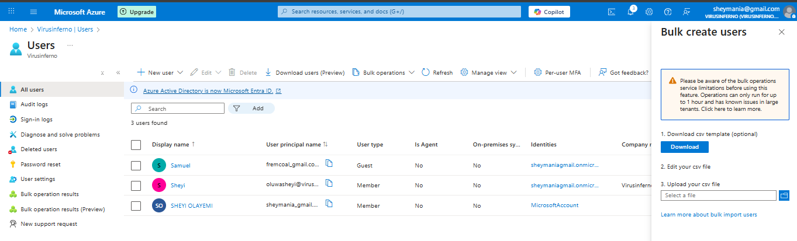
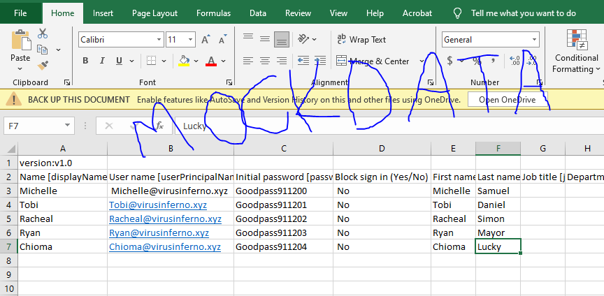
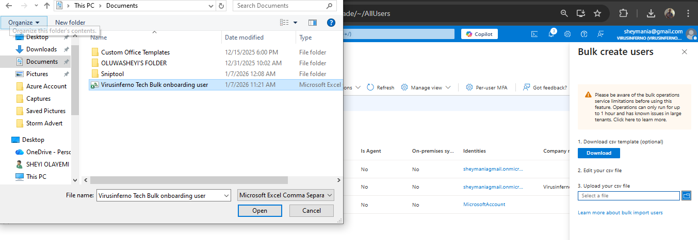
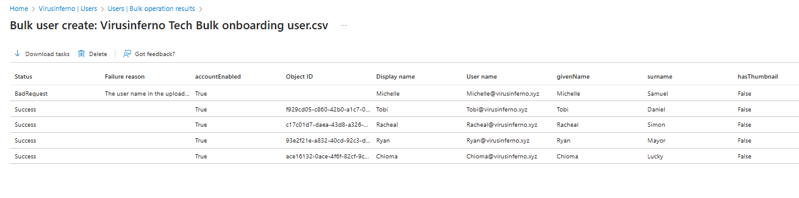
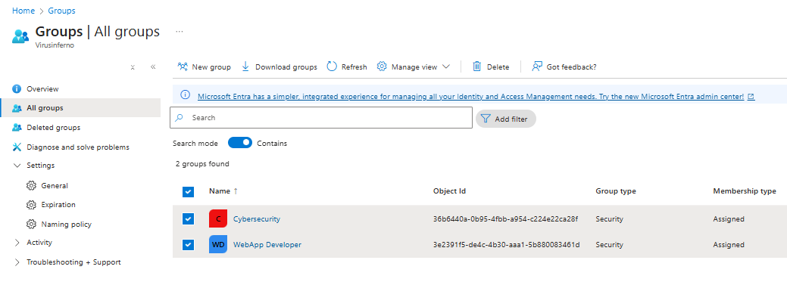

# Bulk User Management & Group Administration

### Introduction & Objective

After manually creating the user "Oluwasheyi," I realized that managing users one by one is inefficient for a growing organization like **VirusInferno Tech**. If I needed to onboard 50 new employees, doing it manually would take hours.

This project focuses on **Scalability** and **Governance**. My objective was to learn how to create users in bulk using automation (CSV files) and, more importantly, how to organize them into **Groups** ("CyberSecurity" and "WebApp Developer") to manage permissions efficiently.

## Implementation Steps

### Part 1: Bulk User Creation (Automation)

I explored the "Bulk Operations" feature to handle mass onboarding.

- **Path:** **Users** > **All users** > **Bulk operations** > **Bulk create**.
- **The Process:**
    1. I downloaded the official Microsoft CSV template.
    2. I learned a critical rule: **Never change the header rows** of the CSV, or the upload will fail.
    3. I populated the file with sample user data (Display Name, User Principal Name, Password).
    4. I uploaded the file back to Azure, which validated and processed the creation of multiple accounts simultaneously.

> Click on download to get the template from azure
> 
> 
> 
> 

Create user data

Upload the saved csv file

View the operation process to see the newly created users

### Part 2: Creating Departmental Groups

To organize my workforce, I moved away from assigning permissions to individuals (which is messy) and adopted the best practice of **Role-Based Access Control (RBAC)** via Groups.

I created two distinct groups for my organization:

1. **Group 1: CyberSecurity**
    - **Type:** Security Group.
    - **Purpose:** To manage access for the security team.
2. **Group 2: WebApp Developer**
    - **Type:** Security Group.
    - **Purpose:** To manage access for the development team.

> 
> 
> 
> 
> 

### Part 3: Group Membership & Role Assignment

Once the groups were created, I added my user, **Oluwasheyi**, to them.

- **Action:** I opened the **CyberSecurity** group, navigated to **Members**, and added `Oluwasheyi`.
- **Result:** `Oluwasheyi` is now a member of the security team.

**The "Power Move" (Assigning Roles to Groups):**
Instead of giving `Oluwasheyi` permissions directly, I assigned permissions to the **Group**.

- **Action:** In the **WebApp Developer** group settings, I navigated to **Roles**.
- **Assignment:** I assigned the **"Application Developer"** role to this group.
- **Outcome:** Because `Oluwasheyi` is a member of the group, he *automatically inherited* the Application Developer permissions. This confirmed that I can now onboard new developers simply by adding them to this group, without configuring their permissions individually.

> 
> 
> 
> 
> 

## Summary

I successfully transitioned from manual management to scalable administration. I established a group structure (**CyberSecurity** and **WebApp Developer**) that allows **VirusInferno Tech** to manage permissions dynamically. `Oluwasheyi` is now securely placed within the organizational hierarchy.

**NEXT PAGE HERE👇👇👇**

[IAM Security Implementation](images/IAM%20Security%20Implementation%202e0d65318cf6800cb803c305559fab70.md)