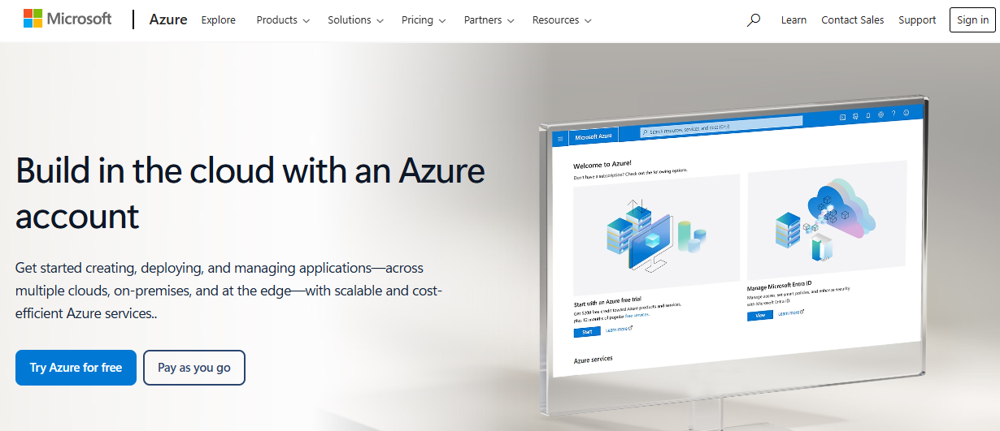
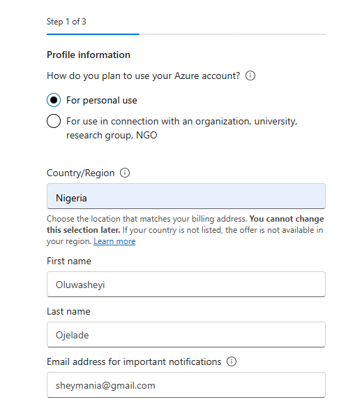
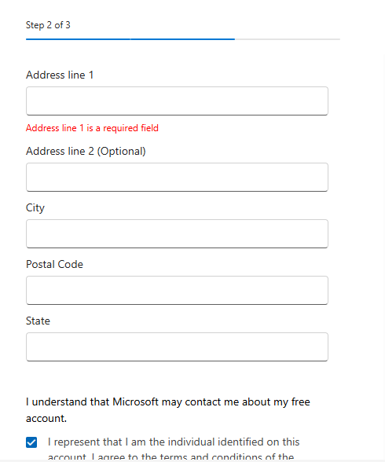
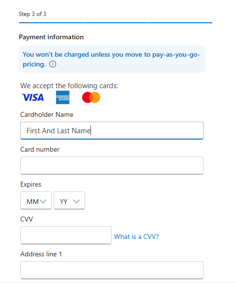
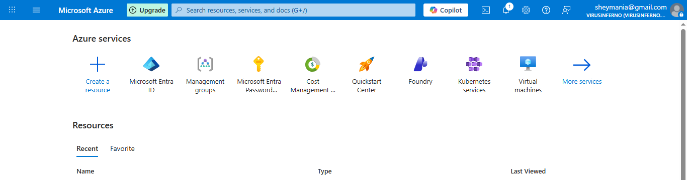

# Creating an Azure Cloud Account

### **Introduction & Objective**

With my custom domain secured, the next critical phase was to create the actual hosting environment, the **Microsoft Azure Tenant**. This account serves as the container for all my future cloud resources.

For this project, I targeted the **Azure Free Tier** subscription. This is essential for my learning path as it provides $200 in free credits for the first month and access to popular services for 12 months, allowing me to build labs without incurring immediate costs.

## Prerequisites & Strategy

I learned from the training that Microsoft has strict fraud detection systems. To ensure a successful "Free Tier" application and avoid the common *"You are not eligible"* error, I ensured I had the following unique data points ready:

- **Email Address:** I used my email, **`sheymania@gmail.com`**, as the primary identity for this account.
- **Phone Number:** A valid phone number for Two-Factor Verification.
- **Payment Card:** A Visa/Mastercard that has **never** been associated with another Azure Free Tier account before.

## Implementation Steps

### Step 1: Initiating the Sign-Up

I navigated to the official Azure portal to begin the registration process. I specifically looked for the "Free Account" offer rather than the "Pay-As-You-Go" model.

- **URL:** `azure.microsoft.com/free`
- **Action:** I clicked on **"Try Azure for free"** and logged in using `sheymania@gmail.com`.

> 
> 
> 
> 
> 

### Step 2: Profile Configuration

Azure required my personal details to establish the legal entity responsible for the account.

- **Country/Region:** I selected **Nigeria**.
- **Details:** I entered my full legal name and phone number. I ensured these matched the details on my banking information to prevent billing flags.

> 
> 
> 
> 
> 

### Step 3: Identity Verification (Phone & Card)

This was the most sensitive part of the setup.

1. **Phone Verification:** I verified my phone number via an SMS code.
2. **Card Verification:** I entered my debit/credit card details. I understood that Microsoft charges a temporary small fee (authorization hold) just to verify the card is active and not a fraudulent bot.

> 
> 
> 
> 
> 

### Step 4: Troubleshooting "Eligibility"

I was aware from my training that if I used a card linked to a previous account, the system would reject me. I ensured my card was fresh to the Azure ecosystem.

- **Outcome:** The system accepted my payment method, proving that my identity and payment instrument were unique.

### Step 5: Accessing the Portal

Once the sign-up was complete, I was redirected to the **Azure Portal** (`portal.azure.com`). This is the command center where I will manage all my resources.

> 
> 
> 
> 
> 

## Summary

I successfully created a **Microsoft Azure Free Tier Tenant**. My environment is now live, credited with $200, and ready for configuration. The next step is to link my custom identity (`virusinferno.xyz`) to this new tenant.

**NEXT PAGE HERE👇👇👇**

[Integrating Custom Domain with Azure Tenant](images/Integrating%20Custom%20Domain%20with%20Azure%20Tenant%202e0d65318cf6801a8be9f2428b826da5.md)