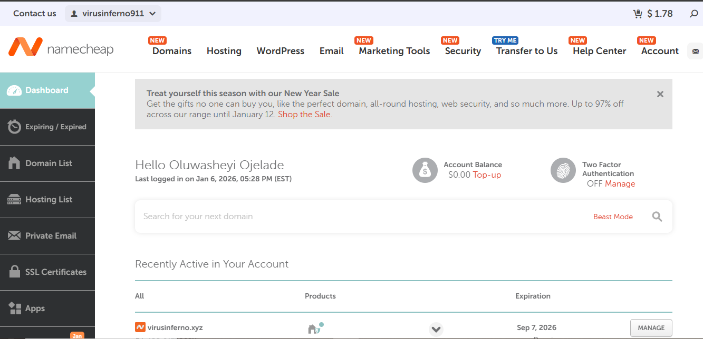

# How To Setup A MicroSoft Azure Cloud Account

## Introduction

This documentation covers the end-to-end process of setting up a professional, enterprise-grade Microsoft Azure Cloud environment. It follows a structured roadmap from domain registration to security hardening and organizational governance.

## **Table of Contents**

1. [Establishing Corporate Digital Identity](https://www.google.com/search?q=%23project-1-microsoft-entra-id-iam--security-setup)
2. [Creating an Azure Cloud Account](https://www.google.com/search?q=%23project-2-creating-an-azure-cloud-account)
3. [Integrating Custom Domain with Azure Tenant](https://www.google.com/search?q=%23project-3-integrating-custom-domain-with-azure-tenant)
4. [Company Branding in Azure Tenant](https://www.google.com/search?q=%23project-4-company-branding-in-azure-tenant)
5. [Azure Entra ID IAM - Single User Management](https://www.google.com/search?q=%23project-5-azure-entra-id-iam---single-user-management)
6. [Bulk User Management & Group Administration](https://www.google.com/search?q=%23project-6-bulk-user-management--group-administration)
7. [IAM Security Implementation](https://www.google.com/search?q=%23project-7-iam-security-implementation)
8. [Azure Cloud Organizational Hierarchy & Governance](https://www.google.com/search?q=%23project-8-azure-cloud-organizational-hierarchy--governance)

---

## Establishing Corporate Digital Identity

## Introduction

The first step in setting up my Azure environment was to establish a unique corporate identity. I needed a custom domain name to replace the default `.onmicrosoft.com` address provided by Azure. For this project, I chose **`virusinferno.xyz`** as my organization's identity.

### **Understanding Domains**

A **Company Domain** is your business's unique address on the internet (e.g., virusinferno.xyz). It is a "global object," meaning once registered, it is unique to you. We use **Authoritative Domain Providers** (like Namecheap, GoDaddy) to manage these records.

## Implementation Steps

### Step 1: Choosing a Registrar

I used **Namecheap** as my domain registrar because it is an Authoritative Domain Provider, meaning they are authorized to register unique names on the internet.

> 
> 
> 
> 
> 

### Step 2: Domain Registration

I searched for my company name, **`virusinferno.xyz`**, to ensure it was available globally. Once confirmed, I proceeded to purchase it.

- **Domain Name:** `virusinferno.xyz`
- **Pricing:** I reviewed the retail price vs. the renewal price to ensure it fit my budget.

> 
> 
> 
> 
> 

### Step 3: DNS Access

After purchasing, I verified that I had access to the **Advanced DNS** settings in the Namecheap dashboard. This is the most critical part, as I will need to access this section later when integrating the custom domain with Azure.

> 
> 
> 
> 
> 

## Summary

I successfully secured **`virusinferno.xyz`** as my digital property. This domain is now ready to be linked to my Azure Tenant in the next stages of the project.

---

**NEXT PAGE BELOW** 👇👇

[Creating an Azure Cloud Account](images/Creating%20an%20Azure%20Cloud%20Account%202e0d65318cf680709a0fd1d60a30e677.md)