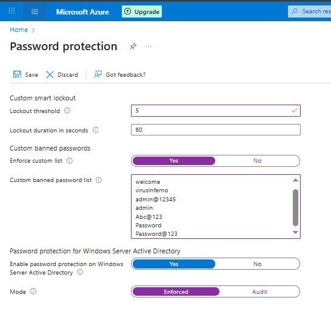

# IAM Security Implementation

### **Introduction** & Objective

Creating users and groups is only the beginning. My next priority was to **harden** the security of the **VirusInferno Tech** tenant. I learned that Identity is the new security perimeter, so I needed to implement "Defense in Depth" strategies to protect against common attacks like Brute Force, Password Spraying, and Phishing.

In this project, I moved beyond simple passwords to implement **Smart Lockouts**, **Banned Password Lists**, and the most critical control: **Multi-Factor Authentication (MFA)**.

## Implementation Steps

### Pillar 1: Password Protection (Smart Lockout)

I configured Azure to automatically block attackers trying to guess passwords.

- **Path:** **Protection** > **Authentication methods** > **Password protection**.
- **Configuration:**
    - **Lockout Threshold:** I set this to **5**. This means if an attacker gets the password wrong 5 times, the account locks.
    - **Lockout Duration:** I set this to **60 seconds**. This slows down automated attacks significantly.

> [
> 
> 
> 
> 

### Pillar 2: Custom Banned Passwords

To prevent users from creating weak passwords like "VirusInferno123" or "Password1", I created a custom ban list.

- **Action:** In the same Password Protection menu, I enabled the **"Custom banned password list"**.
- **Input:** I uploaded a list of common weak terms (e.g., `admin`, `welcome`, `virusinferno`).
- **Testing:** I confirmed that if a user tries to change their password to include these words, Azure rejects it immediately.

### Pillar 3: Multi-Factor Authentication (MFA)

I decided to enable MFA specifically for my key user, `sheyi`.

1. **Disabling Defaults:** First, I ensured "Security Defaults" was disabled (as it forces MFA for everyone, but I wanted granular control for this lab).
2. **Enabling Per-User MFA:**
    - **Path:** **Users** > **Per-user MFA**.
    - **Action:** I selected `sheyi`, clicked **"Enable"**, and then **"Enforce"**.

**The User Experience:**
When I logged in as `sheyi` after this change, I was interrupted by a screen saying *"More information is required."* I was forced to download the **Microsoft Authenticator App**, scan a QR code, and verify my identity. This confirmed that the account is now protected against credential theft.

> Here is how i disabled the security default
> 

Enabled MFA for a user(Sheyi) which also says enforced

### Pillar 4: Auditing & Visibility

Finally, I verified that I could track user activity.

- **Path:** **Users** > **Sign-in logs**.
- **Analysis:** I inspected the logs for `sheyi`. I could see the IP address, location (Lagos, Nigeria), and confirmation that MFA was successfully satisfied.

> Users Sign-in logs
> 
> 
> 
> 

## Summary

I have successfully hardened the security posture of **VirusInferno Tech**. By implementing Smart Lockouts and MFA for `sheyi`, I have drastically reduced the risk of compromise. I now have full visibility into who is accessing my environment and how.

**FINAL PAGE HERE👇👇👇**

[Azure Cloud Organizational Hierarcy & Governance](images/Azure%20Cloud%20Organizational%20Hierarcy%20&%20Governance%202e0d65318cf68092a760e3411d641780.md)