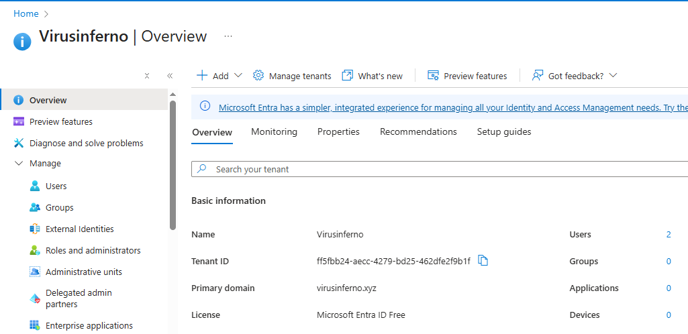
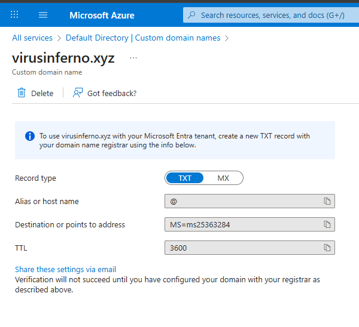

# Integrating Custom Domain with Azure Tenant

### **Introduction & Objective**

After creating my Azure account, I noticed my default identity was a generic address ending in `.onmicrosoft.com`. To professionalize my environment and match my corporate identity, I needed to integrate the custom domain I purchased in Project 1 (`virusinferno.xyz`) into my Azure Tenant.

This project involves configuring **Microsoft Entra ID** (formerly Azure Active Directory) to recognize and trust my domain.

## Implementation Steps

### Step 1: Tenant Configuration (Renaming)

Before adding the domain, I wanted to ensure the Tenant itself carried my organization's name rather than the "Default Directory" label.

- **Action:** I navigated to **Microsoft Entra ID** via the Azure Portal.
- **Modification:** In the **Properties** tab, I renamed the tenant to **"VirusInferno"** to ensure consistent branding across the platform.

> 
> 
> 
> 
> 

### Step 2: Initiating Domain Integration

I proceeded to add the domain to the directory.

- **Path:** **Microsoft Entra ID** > **Manage** > **Custom domain names**.
- **Action:** I clicked **"+ Add custom domain"** and typed in **`virusinferno.xyz`**.

> 
> 
> 
> 
> 

### Step 3: Proof of Ownership (DNS Verification)

This was the most technical part of the project. Azure needed to verify that I actually own `virusinferno.xyz`.

- **The Challenge:** Azure provided me with a specific **TXT Record** (a text value starting with `MS=ms...`). I had to place this value inside my domain registrar to prove ownership.
- **Action:**
    1. I copied the TXT value from the Azure Portal.
    2. I opened a new tab and logged into my **Namecheap Dashboard**.
    3. I navigated to **Advanced DNS** for `virusinferno.xyz`.
    4. I created a new **TXT Record** with Host: `@` and Value: `[Paste Azure Value]`.

> https://drive.google.com/file/d/1DPHKaBSlnIqCvK37tR9RnoV8631Yc0PA/view?usp=sharing
> 

### Step 4: Verification & Finalizing

After saving the DNS record, I returned to the Azure Portal.

- **Propagation:** I waited a few minutes for the global DNS servers to update.
- **Verification:** I clicked the **"Verify"** button. Azure successfully detected the record and confirmed my ownership.
- **Make Primary:** To ensure all future users automatically get the correct email extension, I selected `virusinferno.xyz` and clicked **"Make primary"**.

> 
> 
> 
> 
> 

## Summary

I have successfully bridged the gap between my external domain provider and my internal cloud environment. My Azure Tenant now recognizes **`virusinferno.xyz`** as its primary identity, allowing me to create professional user accounts in the next phase.

**NEXT PAGE HERE👇👇👇**

[Company Branding In Azure Tenant](images/Company%20Branding%20In%20Azure%20Tenant%202e0d65318cf6803a9307c212497e07e5.md)