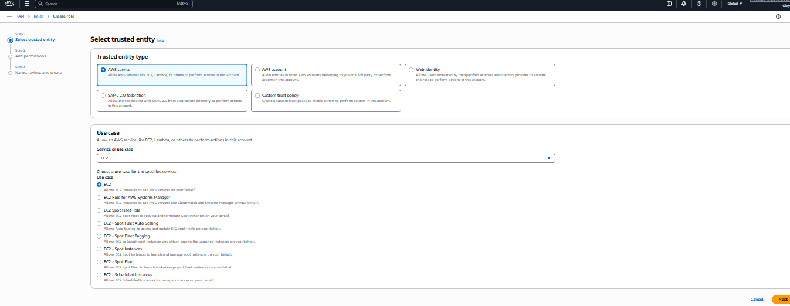

# AWS IAM Role Configuration

SUMMARY:

An AWS IAM Role is created from the IAM dashboard by defining a trusted entity, typically an AWS service such as EC2 or Lambda, that will assume the role. During creation, the appropriate permission policies are attached to specify what actions the service is allowed to perform. Optional tags can be added for organization and tracking purposes before the role is reviewed and created. Once created, the role is attached to the relevant AWS resource, allowing it to access other AWS services securely using temporary credentials instead of long-term access keys. IAM roles follow the principle of least privilege and are the recommended method for granting permissions to AWS services.

AWS IAM Role – Step-by-Step Guide:

**STEP ONE**

Open IAM Roles:

- Sign in to the **AWS Management Console**
- Search for **IAM**
- Click **Roles** from the left-hand menu
- Click **Create role**
- Select the specific service use case (for example, **EC2**)
- This defines how the service will assume the role
- Click **Next**

**STEP TWO**

Attach Permissions Policy:

- Click **Next**
- Multiple policies can be attached if needed
- Choose the required permission policy (e.g. AdministratorAccess)

**STEP THREE**

Name and Create Role:

- Enter a **Role name** (e.g. EC2-S3-ROLE-1)
- Review trusted entity and permissions
- Click **Create role**

STEP FOUR:

Verify Role Creation:

- Confirm the role appears in the **Roles list**
- Open the role to review:
    - Trusted entities
    - Permissions
    - Policies attached

**STEP FIVE**

Attach Role to AWS Resource:

- Go to the service using the role (e.g. **EC2 instance**)
- Attach the role to the resource
- The service now inherits the permissions of the role

### STEP SIX

Test Role Permissions:

After attaching the role, access the required AWS services from the associated resource to verify that the role works as expected and that only the permitted actions can be performed.

**STEP SEVEN**

Apply Best Practices:

Use IAM roles instead of long-term access keys, assign permissions based on least privilege, and regularly review and update role policies to maintain strong security.

NOTE: An IAM Role is a secure way to grant AWS services or users temporary permissions without using long-term credentials.