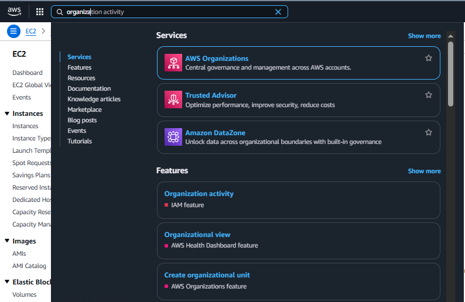

# Creating and Configuring an AWS Organization

SUMMARY:

Creating an AWS Organization centralizes management of multiple AWS accounts under a single management account. First, open AWS Organizations, choose the feature set (All Features is recommended), and create the organization. Next, create or invite member accounts by providing an email and account name, or group accounts into Organizational Units (OUs). Once accounts are added, you can attach Service Control Policies (SCPs), enable consolidated billing and centralized logging, and manage access via an automatically-created cross-account IAM role or AWS Identity Center. This centralized model simplifies governance, billing, and security while letting teams work in isolated member accounts, such as a development account that the management team can inspect and access when needed.

**Step-by-step (search → create org → add/create account → see account → login to development account)**

**STEP ONE**

How to search for AWS Organizations in the Console:

- Sign in to the AWS Management Console with the management account (root or IAM with Organizations permissions).
- In the Console’s top-left search bar type **Organizations** and select **AWS Organizations** from the results.

**STEP TWO**

How to create an Organization (if not already created):

- In **AWS Organizations** click **Create organization** (or **Get started**).
- Select **Feature set**: choose **All features** (recommended for full policy & governance control) or **Consolidated billing only** if you only want billing control.
- Confirm to create the Organization. The account you used becomes the **management account**.

**STEP THREE**

How to add / create an account inside the Organization:

1. In the Organizations left menu click **Accounts** → **Add account** (or **Create account**).
2. Choose **Create an AWS account** (not Invite) and fill required fields:
    - **Account name**: e.g. `development`
    - **Email address**: e.g. `dev-team+aws@example.com` (must be unique)
    - **IAM role name**: leave default `OrganizationAccountAccessRole` or set your preferred role name (this role lets the management account assume an admin role in the new account).
3. Click **Create** (or **Create account**). The console will create the account and return a creation status/entry in the Accounts list.
    - If instead you choose **Invite an existing account**, you must provide its Account ID or email and the account owner must accept the invitation from their account.

> Tip: keep a record of the new account’s Account ID and the IAM role name you specified,  you will need them to switch into the account.
> 

**STEP FOUR**
See the account added (example: `development`):

- In **AWS Organizations** → **Accounts** use the search/filter box and type the account name `development`.
- Click the `development` row to open **Account details** and copy:
    - **Account ID**
    - **Account email**
    - **Role name** (if you provided one during creation; default is `OrganizationAccountAccessRole`)
- Confirm the account state (Created / Succeeded). The account entry will show the account name and ID in the list.

**STEP FIVE**

Login to the `development` account (recommended methods)

- Create an IAM user inside the `development` account (or have the dev team create one) and attach the needed policies.
- Use the development account’s console sign-in link or go to **https://console.aws.amazon.com/** and sign in with that IAM user’s credentials.

