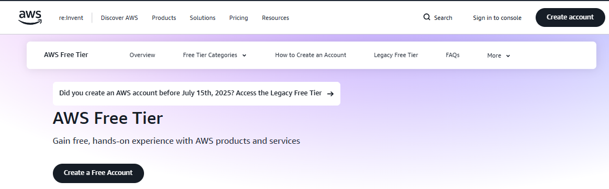

# How To Create Aws Account

## **TABLE OF CONTENTS**

### **1. Introduction**

- Project overview
- Objectives and expected outcomes
- Tools & Services used

### **2. Creating an AWS Account**

- Signing up
- Choosing account plan
- Adding billing information
- Securing the root account

### **3. AWS IAM Setup**

- Account Alias configuration
- Creating IAM Users
- Creating IAM Groups
- Assigning permissions & policies
- IAM Best practices

### **4. AWS IAM Role Configuration**

- Creating roles
- Assigning trusted entities
- Attaching policies
- Testing Role permissions
- Best practices

### **5. Creating and Configuring AWS Organization**

- Creating AWS Organization root
- Adding and structuring organizational units
- Creating member accounts (e.g., Development)
- Verifying accounts
- Logging into member accounts

### **6. AWS IAM Identity Center Setup**

- Activating IAM Identity Center
- Creating permission sets
- Assigning users and groups
- Access Portal URL configuration
- Cross-account access setup

### **7. Final Project Review**

- Screenshots summary
- Challenges faced
- Lessons learned
- Important security notes
- Recommended next steps

INTRODUCTION:

To create an AWS account, visit **aws.amazon.com** and click **Create an AWS Account**. Enter a valid email address (this will be your root account email), choose an account name, and create a strong password.

Next, select whether the account is for **Personal** or **Business** use and provide your contact information. Add a valid debit or credit card. AWS will place a small temporary charge (usually about $1) to verify the card, which is refunded later.

Complete phone verification by receiving a one-time code via SMS or call. Once verified, choose the **Basic Support Plan (Free)** to finish the signup process.

After registration is complete, sign in at **console.aws.amazon.com** using your root email and password.

For security, immediately enable **Multi-Factor Authentication (MFA)** on the root account. Then, create an **IAM user with AdministratorAccess** and use that user for all daily activities instead of the root account.

To avoid unexpected charges, stay within the **AWS Free Tier**, stop or terminate unused resources, and set up billing alerts.

Once these steps are complete, your AWS account is ready for use.

**STEP ONE:**

Visit: 

- Open **aws.amazon.com**
- Click **Create a free Account**

**STEP TWO:**

Enter account details:

You will be asked for:

- **Email address** (this becomes the root account email)
- **AWS account name** (any name you like)
- **Password**

Note: Use an email you will always have access to.

**STEP THREE:**

**Choose your account plan:**

On the **Choose your account plan** page, select **Free Plan**. This gives you access to the AWS **Free Tier**, which is ideal for learning, practice, and small projects. Click **Continue**.

**STEP FOUR:**

Enter Contact Information:

Choose **Personal** unless you're creating the account for a company.

Fill in your full name, phone number, country, and address as requested.

Accept the AWS Customer Agreement, then click **Continue**.

**STEP FIVE:**

Add Payment Method:

Enter your **debit or credit card** details. AWS will charge a small temporary amount (usually around $1) to verify the card. This charge is refunded after verification. Click **Verify and Continue**.

**STEP SIX:**

Phone Verification:
Enter your phone number. Choose whether to receive the verification code via **SMS or voice call**. Enter the one-time PIN sent to your phone and click **Verify**.

**STEP SEVEN:**

Select a Support Plan:

Select **Basic Support (Free)**. This plan is sufficient for beginners and learning purposes. Click **Complete Sign Up**.

**STEP EIGHT:**

Sign In to the AWS Management Console

After successful registration, go to: **https://console.aws.amazon.com**

Sign in using your **root email address and password**.

STEP NINE:

Secure the Root Account (Important):

- Navigate to **IAM → Security credentials**
- Enable **Multi-Factor Authentication (MFA)** on the root account

**STEP TEN:**

Create an IAM User for Daily Use:

Go to **IAM → Users → Create user**.

Assign **AdministratorAccess** permissions.

Use this IAM user for daily activities instead of the root account.

[**AWS IAM Setup: Account Alias and User Management**](images//AWS%20IAM%20Setup%20Account%20Alias%20and%20User%20Management%202cad65318cf6807082ebd3d4bd8ea537.md)

[AWS IAM Role Configuration](images//AWS%20IAM%20Role%20Configuration%202cbd65318cf680ad87f6c998bde7cb7c.md)

[Creating and Configuring an AWS Organization](images//Creating%20and%20Configuring%20an%20AWS%20Organization%202cbd65318cf6808c93b0eeb1e68df1d8.md)

[Creating and Configuring AWS IAM Identity Center](images//Creating%20and%20Configuring%20AWS%20IAM%20Identity%20Center%202ccd65318cf680ca8892c4fa18a3b0e5.md)