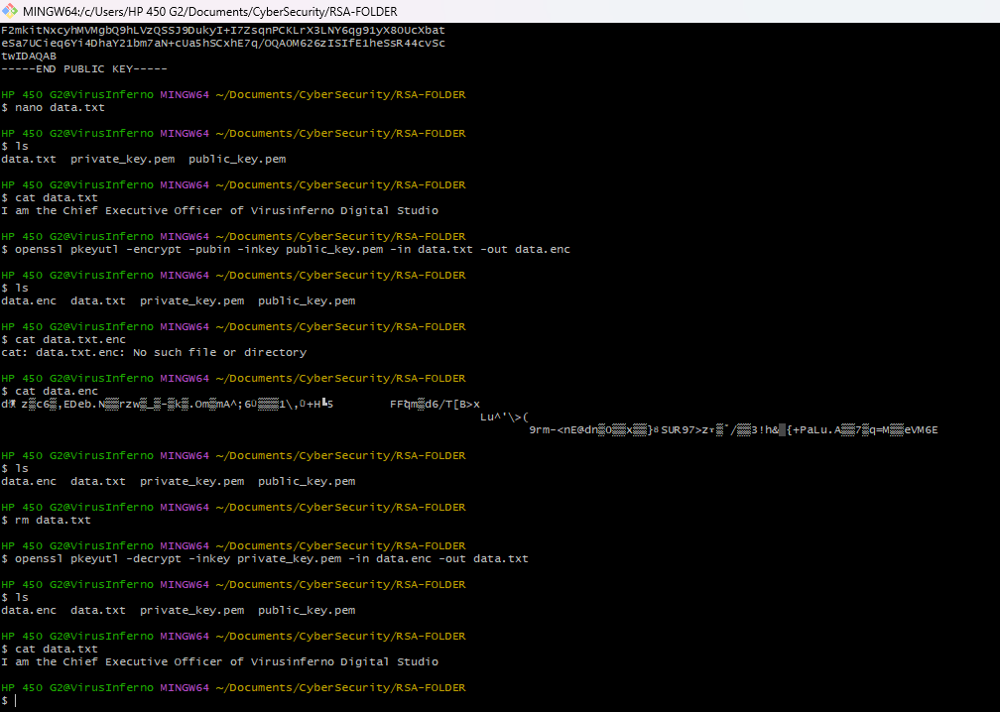

# 🛡️Enterprise Cloud Security & Vulnerability Management: Practical Lab

**Project Author:** Oluwasheyi Ojelade
**Status:** ✅ Completed
**Tech Stack:** AWS (Systems Manager, Config, EC2, IAM), OpenSSL, Exploit-DB, VirusTotal.
**Focus:** **Cryptography, OSINT/Reconnaissance, and AWS Automated Security Operations.**

---

## Module 1: Applied Cryptography & Threat Intelligence

### 1.1 Asymmetric Encryption via CLI (OpenSSL)

To securely transmit data without exchanging a vulnerable symmetric key, Asymmetric Encryption (Public/Private Key pair) is utilized.

**Step-by-Step Execution:**

1. **Open a Linux Terminal:** (Local or Cloud VM).
2. **Generate the Private Key:** Create a 2048-bit RSA private key.Bash
    
    `openssl genrsa -out private_key.pem 2048`
    
3. **Extract the Public Key:** Derive the shareable public key from the private key.Bash
    
    `openssl rsa -in private_key.pem -pubout -out public_key.pem`
    
4. **Create a Secret File:** Create a text file containing sensitive data.Bash
    
    `nano data.txt`
    
5. **Encrypt the File:** Encrypt the data using the *Public Key*. If intercepted, the file (`data.enc`) appears as unreadable, garbled text.Bash
    
    `openssl pkeyutl -encrypt -pubin -inkey public_key.pem -in data.txt -out data.enc`
    
6. **Decrypt the File:** Decrypt the cipher text using the tightly secured *Private Key*.Bash
    
    `openssl pkeyutl -decrypt -inkey private_key.pem -in data.enc -out data.txt`
    

> **Terminal showing the gibberish cipher text of `data.enc` alongside the successfully decrypted `data.txt`**
> 
> 
> 
> 

### 1.2 Cryptographic Hashing & Attacks

Hashing converts data into a fixed-size output (Message Digest) using algorithms like MD5 or SHA-256. Modern systems defend against hash-cracking by using **Key Stretching** algorithms (e.g., PBKDF2, Bcrypt) which enforce computational delays on every guess.

**Step-by-Step Execution:**

1. Open a web browser and navigate to an online MD5 Hash Generator.
2. Type a word (e.g., "Hello") and generate the hash. Note the 32-character output.
3. Change the word slightly (e.g., "hello" with a lowercase 'h') and generate the hash again.
4. Observe the "Avalanche Effect"—a single micro-change alters the entire hash, ensuring data integrity.

### 1.3 Social Engineering & Threat Analysis

**Step-by-Step Execution:**

1. **Phishing Quiz:** Navigate to the Google Jigsaw Phishing Quiz. Practice hovering over URLs to spot deceptive domains (e.g., `drive-google.com` vs. the legitimate `drive.google.com`).
2. **VirusTotal Analysis:** Open `virustotal.com`. Scan suspicious URLs or file hashes against dozens of antivirus engines to verify malicious payloads before permitting them into the corporate network.

---

## Module 2: Vulnerability Management & Exploitation

### 2.1 The Vulnerability Ecosystem

Security engineers track the lifecycle of system vulnerabilities using standard frameworks:

- **CWE:** Common Weakness Enumeration (The root cause).
- **CVE:** Common Vulnerabilities and Exposures (The specific assigned ID).
- **NVD:** National Vulnerability Database (Scores CVEs using the CVSS scale of 0-10).

### 2.2 Offensive Security: Exploit-DB & Google Dorking

To defend a network, one must understand how an attacker reconnoiters it.

**Step-by-Step Execution:**

1. **Exploit-DB Investigation:** Navigate to `exploit-db.com`. Search for known CVEs (e.g., a Windows or Trend Micro vulnerability) to view the raw Python, C, or Bash scripts hackers use to weaponize them.
2. **Google Dorking (GHDB):** Open Google and use advanced search operators to scrape the internet for exposed cloud credentials.
    - *Type the exact query:* `site:github.com "BEGIN OPENSSH PRIVATE KEY"`
    - *Result:* This reveals GitHub repositories where developers have accidentally committed and pushed their private `.pem` keys to the public internet, showcasing severe cloud misconfigurations.

> **[ 🖼️ INSERT SCREENSHOT: Exploit-DB webpage showing a Remote Code Execution script OR your Google search utilizing the GHDB dork ]**
> 

---

## Module 3: AWS Cloud Security Operations Lab (Core Project)

**Objective:** Manage cloud servers without exposing SSH ports, automate security patching, and enforce configuration compliance using AWS-native tools.

### 3.1 Secure EC2 Provisioning (Zero SSH)

By eliminating Port 22 entirely, we remove the primary attack vector for brute-force SSH attacks.

**Step-by-Step Execution:**

1. Log into the AWS Management Console -> **EC2** -> **Launch Instance**.
2. **Name:** `Secure-Web-Server`
3. **AMI:** Amazon Linux 2023.
4. **Key Pair:** Select **Proceed without a key pair (Not recommended)**.
5. **Network Settings:** Set **Auto-assign Public IP** to **Enable** (required for SSM Agent communication).
6. **Security Group:** Edit the default security group and **Delete** the rule allowing SSH on Port 22.
7. Click **Launch Instance**.
8. **Access via SSM:** Once running, select the instance, click **Connect**, choose the **Session Manager** tab, and click **Connect**. A secure terminal opens in the browser. Test access by running `whoami` and `pwd`.

> **[ 🎥 INSERT SHORT VIDEO: Recording of your screen connecting to the EC2 instance via AWS Session Manager and running Linux commands, proving you are logged in without SSH ]**
> 

### 3.2 Automated Patch Management

To mitigate the "Window of Opportunity" for zero-day exploits, patch management must be fully automated.

**Step-by-Step Execution:**

1. Open **AWS Systems Manager (SSM)** -> **Node Management** -> **Patch Manager**.
2. Click **Configure patching** or **Start with an overview**.
3. **Targeting:** Select your EC2 instance.
4. **Patching Operation:** Select **Scan and install**.
5. **Schedule:** Set up a daily cron job schedule (e.g., every day at 1:00 AM) to fully automate the patching process across the fleet.

> **[ 🖼️ INSERT SCREENSHOT: AWS SSM Patch Manager dashboard showing a "Success" status for a Patch installation ]**
> 

### 3.3 Configuration Drift & Automated Remediation (AWS Config)

Human error (e.g., accidentally opening a firewall port) is mitigated using continuous compliance monitoring and automated remediation.

**Step-by-Step Execution:**

1. **Rule Creation:** Open **AWS Config** -> **Rules** -> **Add rule**. Search for and activate the AWS Managed Rule: `restricted-ssh`.
2. **Detection Test:** Go back to EC2 and intentionally **Add** an Inbound Rule allowing SSH (Port 22) from `0.0.0.0/0`. Return to Config, click **Re-evaluate**, and observe the dashboard flag the resource as **Noncompliant**.
3. **Automated Remediation Setup:** * On the `restricted-ssh` rule page, click **Action** -> **Manage remediation**.
    - Select **Automatic remediation**.
    - Choose the remediation action: `AWSConfigRemediation-RemoveUnrestrictedSshIngress`.
    - Resource ID: `SecurityGroupId`.
    - Attach an IAM Role (e.g., `AmazonSSMAutomationRole`) with permissions to edit security groups. Save.
4. **The Final Test:** Deliberately open Port 22 again. Wait a few minutes. AWS Config automatically triggers the remediation, deletes the dangerous Port 22 rule on its own, and restores the environment to **Compliant**.

> **[ 🎥 INSERT SHORT VIDEO: Record your AWS Config dashboard. Show the `restricted-ssh` rule flagging the Security Group as Noncompliant, and then show the remediation action automatically deleting the rule and returning it to Compliant ]**
>