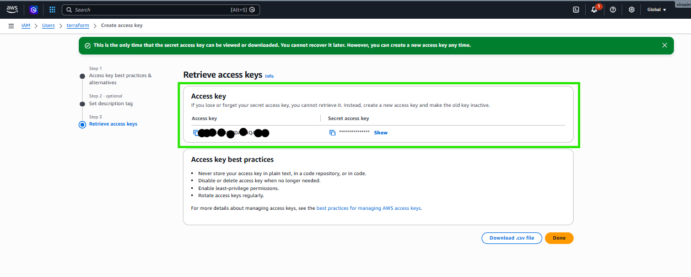
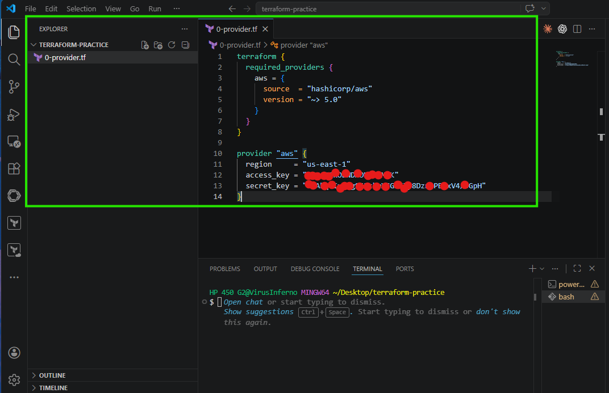
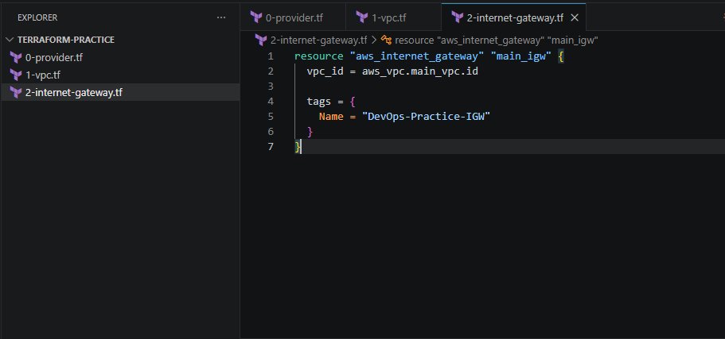
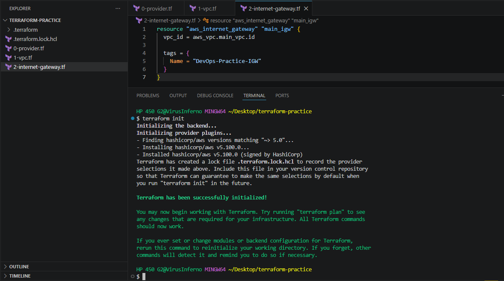
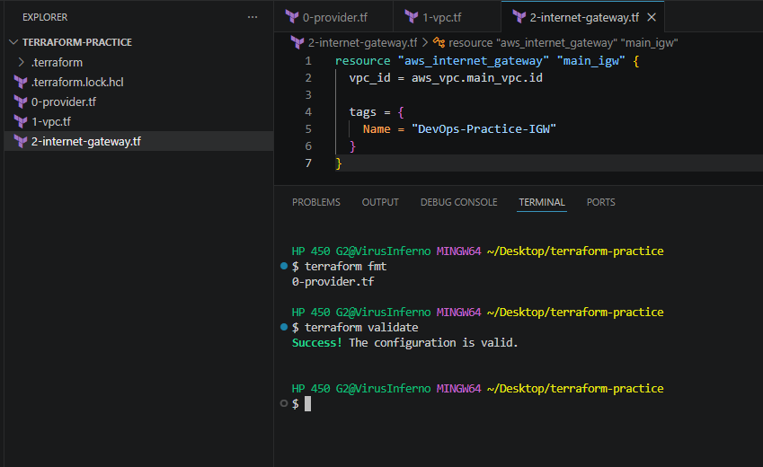
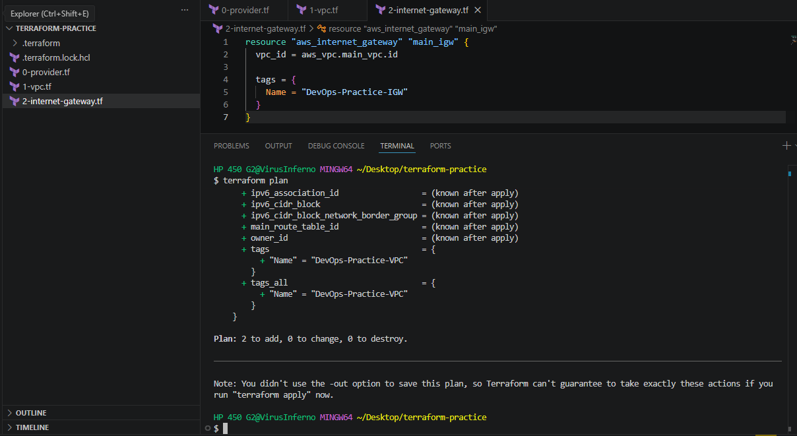
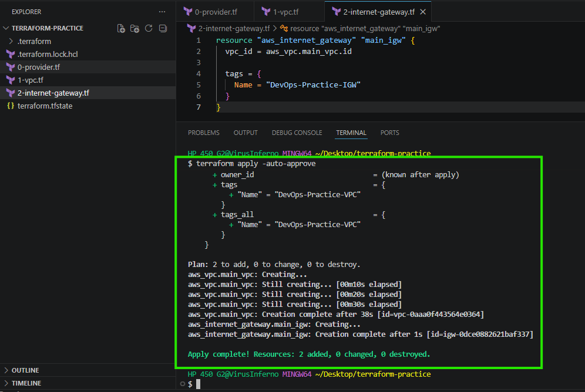
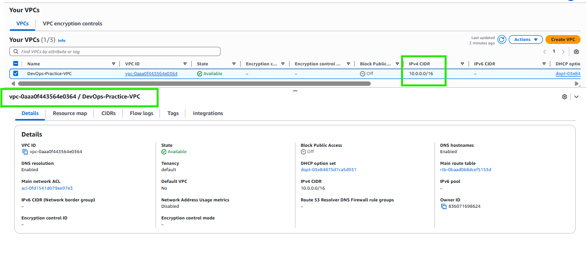
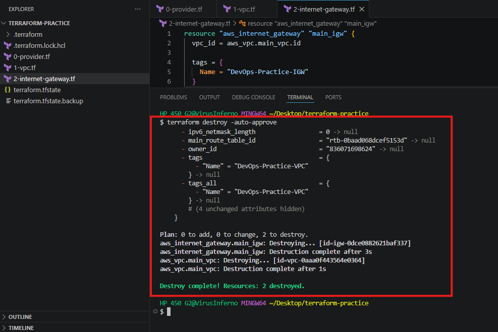

# Infrastructure as Code (IaC): Automating AWS Deployments with Terraform

### Project Overview

The objective of this project was to provision a foundational, highly available AWS networking architecture using **Terraform**. Instead of relying on manual clicks within the AWS Management Console, this project utilizes Infrastructure as Code (IaC) to programmatically deploy a custom Virtual Private Cloud (VPC) and attach an Internet Gateway (IGW), demonstrating a reproducible and scalable cloud engineering workflow.

### Tools & Technologies

- **Cloud Provider:** Amazon Web Services (AWS)
- **IaC Tool:** Terraform (HashiCorp)
- **Identity Management:** AWS IAM (Command Line Interface Access)
- **IDE & Environment:** Visual Studio Code, Windows PowerShell

---

## Execution & Deployment Steps

### Step 1: AWS IAM Authentication Setup

To allow Terraform to interact with the AWS API securely, a dedicated IAM user with programmatic access was created. Administrator permissions were granted, and CLI Access Keys were generated.

> **The IAM Setup**
> 
> 
> 
> 

### Step 2: Provider Configuration

The AWS Provider was defined in the `0-provider.tf` file. This configuration instructs Terraform to download the specific plugins required for AWS and securely passes the region and IAM credentials to authenticate the session.

> **The Provider Code**
> 
> 
> 
> 

### Step 3: Defining the Infrastructure Code

Using HashiCorp Configuration Language (HCL), the networking resources were defined declaratively:

- `1-vpc.tf`: Defined the main VPC with a CIDR block of `10.0.0.0/16` and enabled DNS hostnames.
- `2-internet-gateway.tf`: Created and attached an Internet Gateway dynamically using the VPC's generated ID.

> **The Resource Code**
> 
> 
> 
> 

### Step 4: Initialization

The working directory was initialized using `terraform init`. This step downloaded the necessary AWS provider binaries required to translate the HCL code into AWS API calls.

> **Initialization**
> 
> 
> 
> 

### Step 5: Code Formatting and Validation

To adhere to industry best practices, `terraform fmt` was executed to automatically format the code. Following this, `terraform validate` was run to ensure the configuration was syntactically correct and internally consistent before deployment.

> **Validation**
> 
> 
> 
> 

### Step 6: The Execution Plan

The `terraform plan` command was executed to generate a dry-run of the deployment. This allowed for a secure review of the proposed architecture changes, confirming that exactly two resources (VPC and IGW) would be added.

> **The Plan**
> 
> 
> 
> 

### Step 7: Applying the Infrastructure

The code was pushed to the cloud using `terraform apply -auto-approve`. Terraform successfully communicated with the AWS API to provision the resources in real-time.

> **The Apply Success**
> 
> 
> 
> 

### Step 8: AWS Console Verification

To confirm the API deployment, the AWS Management Console was checked. The newly created `DevOps-Practice-VPC` and its associated Internet Gateway were successfully verified as live in the designated region.

> **AWS Console Verification**
> 
> 
> 
> 

### Step 9: Resource Teardown (Clean Up)

To prevent unnecessary billing and demonstrate complete lifecycle management, the `terraform destroy -auto-approve` command was executed. This safely and efficiently dismantled all resources created during this session.

> **The Teardown**
> 
> 
> 
> 

---

## 🧠 Technical Q&A & Best Practices

*During the implementation, several architectural concepts were reinforced:*

- **CLI vs. GUI:** While the AWS Console (GUI) is accessible, Terraform bypasses it to interact directly with the AWS API, utilizing the exact same underlying mechanisms as the AWS CLI or custom Python scripts.
- **CI/CD Integration:** For production environments, Terraform should not be executed from a local machine. Best practice involves integrating Terraform into a CI/CD pipeline (such as GitHub Actions). Utilizing feature branches and Pull Requests ensures code is reviewed before it automatically triggers a deployment, preventing accidental overrides.
- **State Management Security:** The `terraform.tfstate` file contains sensitive infrastructure blueprints. In a production pipeline, this must be stored remotely (e.g., encrypted in an AWS S3 bucket) rather than locally.